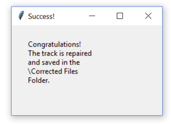

# GPX Repair

## Problem 

Here, I provide a small python-based GUI that helps you reestablishing broken GPX-files.


## When can this be useful?
It's a common issue for every sportsman who loves recording activities. Your device runs out of battery before you come back home, you forgot to start the record when you left home or, even worse but a frequent problem in older iPhones, you lost GPS signal somewhere on the track for a couple of minutes. Then if you look at your track, you see ugly straight lines across the map.

## Installation
Clone the repo via:
```
git clone https://github.com/dopexxx/GPX_Repair.git
```
Please make sure to have installed the following:
* Python 3.x
* [gpxpy](https://www.github.com/tkrajina/gpxpy), a useful parser to deal with GPX files
* matplotlib, numpy, tkinter
* cartopy (You only need it if you want to see a map of your track, which is disabeld by default since cartopy is very slows; [known cartopy issue](https://github.com/SciTools/cartopy/issues/403))

Feel free to fork and please report any issues.

## Manual

1. Clone repo and install libraries.
2. If you run the file, the default window of the GUI shows up:

3. You see a coupe of options here, the first step should be to upload your GPX file
4. You get a confirmation message once the file has been parsed successfully
5. Press `Show Tracking Mistakes` to let the algorithm find the missing sections in your file. Per default a tracking mistake is defined as not having recorded a GPX trackpoint for at least **5 sec** with you having moved at least **400m**. I find this okay for cycling but you can change these parameters at the beginning of the code.

    1. A window pops up saying *Great! No error has been found.* This means, your file itself is consistent, but you may want to insert something at the beginning or at the end. To do so, please click on the respective link which directs you to Google Maps. Then you simply have to tell Google where you started/ended your trip.
 
    2. Otherwise, you get an overview of the found errors, i.e. the program displays you the coordinates of the last trackpoint before and the first trackpoint after the missing spot. Now, assuming you want to fill in this gap in your GPX file, please select the number of the error from the dropdown and click *GO!* to instruct GoogleMaps to find the shortest path between the 2 trackpoints. Default vehicle is bicycle. Now you can set easily adjust this snippet such that it fits the route you actually took. 
    

    
6. Now, we want to merge the snippet we just created with the broken track we recorded. For this, we use a nice tool called [mapstogpx](https://www.mapstogpx.com). Past the link from the Google Maps snippet you just created and download the file (make sure you to tick **Advanced Settings -> Include Elevation** before downloading). Please also make sure to remember the distance of the snippet (according to Googe Maps).


7. Tell **GPX_Repair** where you saved the snippet via *Upload GPX fragment*.
8. You have to fill in the distance of the fragment that you want to merge (for some reason, ```gpxpy.geo.haversine_distance``` behaves a bit erratically and consequently speed estimation for ). Then press "*OK*" and then "*Repair!*"
9. Hopefully, everything went through and the repaired file was saved in the directory "*Corrected Files*"
    

10. If you have multiple issues with your GPX file, just repeat the procedure.


## ToDo

1. Export code to an .exe for non-python Users.
2. Make speed prediction realistic
3. I hold it with Johan Wolfgang von Goethe, "*If I would have had time, you would have got condensed code*"
